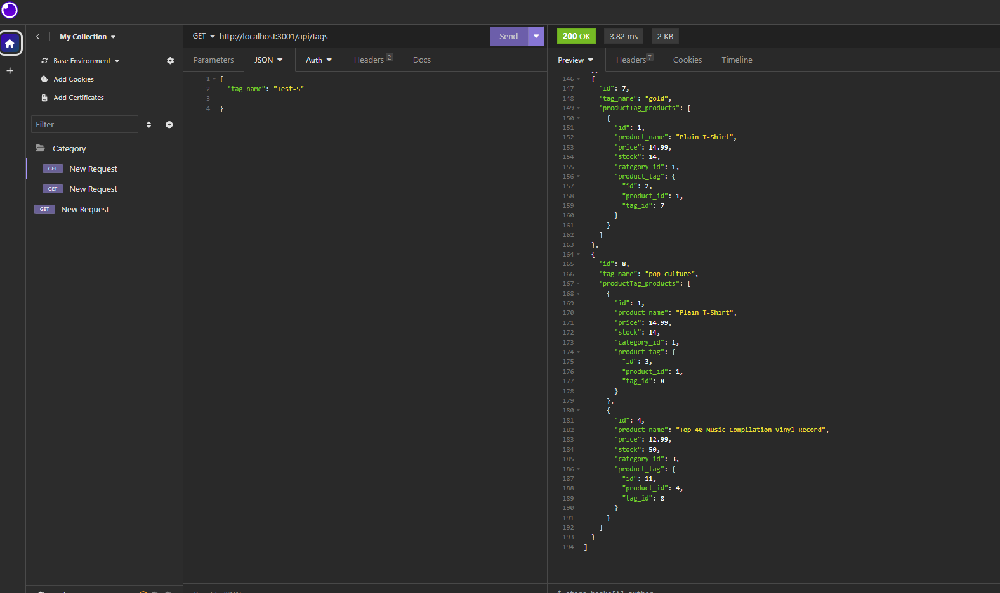

# E-Commerce Back End

Building the back end for an e-commerce site.

## Table of Contents
- [Description](#description)
- [Installation](#installation)
- [Usage](#usage)
- [Features](#features)
- [Screenshots](#screenshots)
- [Screen Recording of Application Demo](#screen-recording-of-application-demo)
- [License](#license)

## Description

Building the back end for an e-commerce site.

## Installation

1. Clone the repository
    
2. Install dependencies:
   ```bash
   npm i


## Usage
1. Run the application using the following command:
    ```bash
    mysql -u root -p 


## Features

- Express.js
- MySQL
- Sequelize
- dotenv

## Screenshots



## Screen Recording of Application Demo

https://drive.google.com/file/d/1tvFR6Oc0uWfpTvnbGlou_ouUgIYRpUjw/view


## License

This project is licensed under the MIT License.


